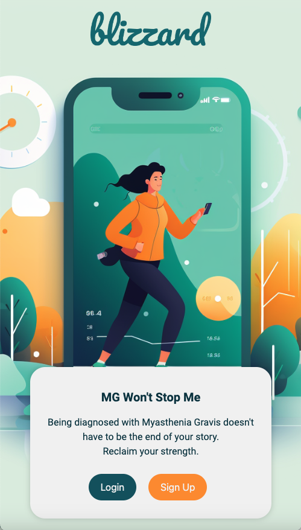
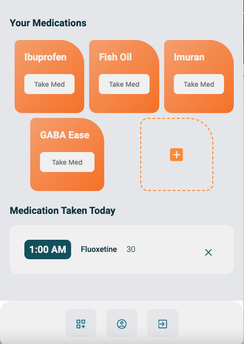
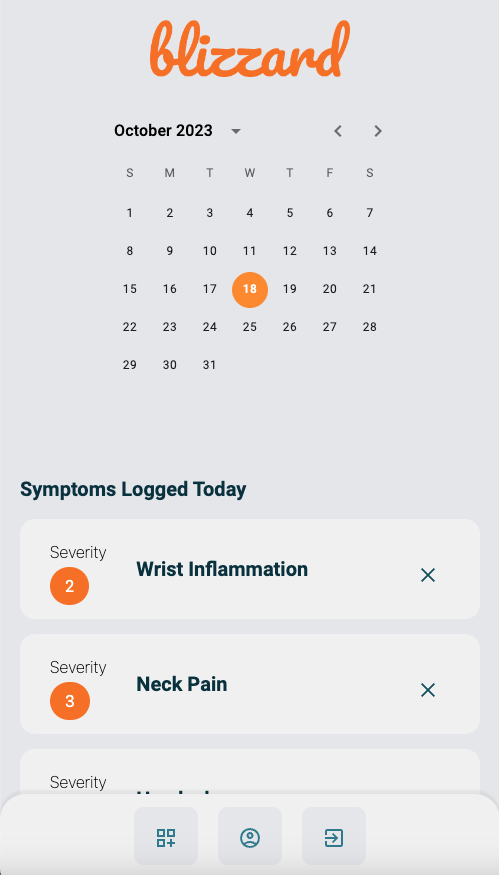

# Blizzard MG Application

Myasthenia Gravis (MG) is a chronic autoimmune, neuromuscular disease that causes weakness in the skeletal muscles. Antibodies block muscle receptor connections. MG is considered a "snowflake" disease, because like a snowflake, MG can look different for every person.

People with MG often struggle with managing symptoms, medications and other aspects of their live after being diagnosed. This application is intended to change that, and assist people with MG in living a more full, controlled life with the knowledge they gain from tracking patterns in symptoms and triggers.

Eventually, this application will be enhanced to analyze the data given by users to provide them with personalized trend information, aimed to giving them the answers they seek on what is causing their symptoms and how they can alleviate them.

By pairing MG's associated teal color with hues of bright oranges and whimsical illustrations, the aesthetics of the app are intended to provide the user with a soothing but uplifting and inspiring atmosphere.

## Table of Contents

- [Technologies](#Technologies)
- [Screenshot](#Screenshot)
- [Deployment](#Deployment)
- [Copyright](#Copyright)

## Technologies

Tools used in this application:

- React
- HTML / CSS / JavaScript
- Node.js
- Express.js
- NoSQL - MongoDB database
- GraphQL queries & mutations
- Material UI icons
- Material UI Date Picker (calendar)

## Screenshot

## Deployment

To view the deployed application on Heroku, [click here.](https://blizzard-mg-2139349e4552.herokuapp.com/)

To view my repository code, [click here.](https://github.com/michiewillman/mgapp)

## License

Copyright (c) 2023 Michie Willman
